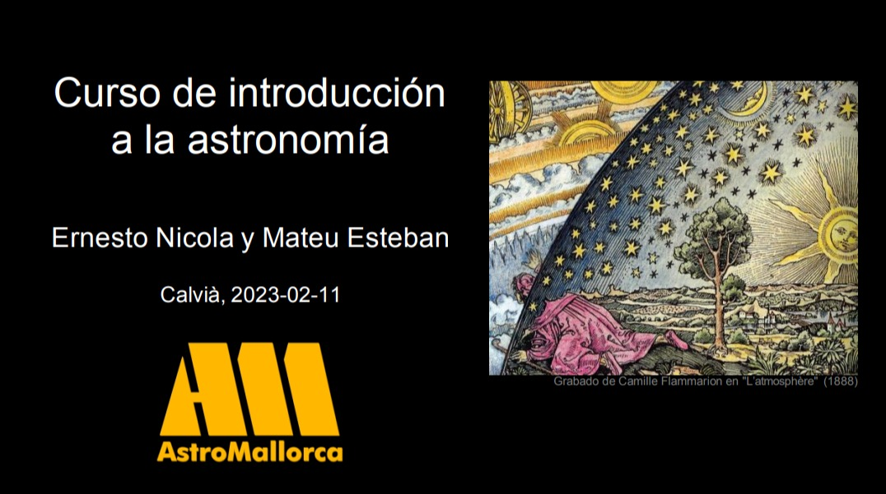

# Curso de introducción a la astronomía
## Calvià 11-02-2023 ([Finca Galatzó](http://www.calvia.com/responsive/general.plt?KPAGINA=2687&KIDIOMA=2))
## [Curso](../projecte.md) [organizado por AstroMallorca](https://astromallorca.wordpress.com/)
## Docentes: [Ernesto Nicola](../bio-ernesto.md) y [Mateu Esteban](../bio-mateu.md)

### 1. El cielo a simple vista [PDF](2023-02-11_1_Cielo_a_Simple_Vista.pdf)
### 2. El sistema solar [PDF](2023-02-11_2_Sistema_Solar.pdf)
### 3. Objetos del cielo profundo: Estrellas, nebulosas, cúmulos y galaxias [PDF](2023-02-11_3_Cielo_Profundo.pdf)
### 4. Historia del Universo [PDF](2023-02-11_4_Cosmologia.pdf)
